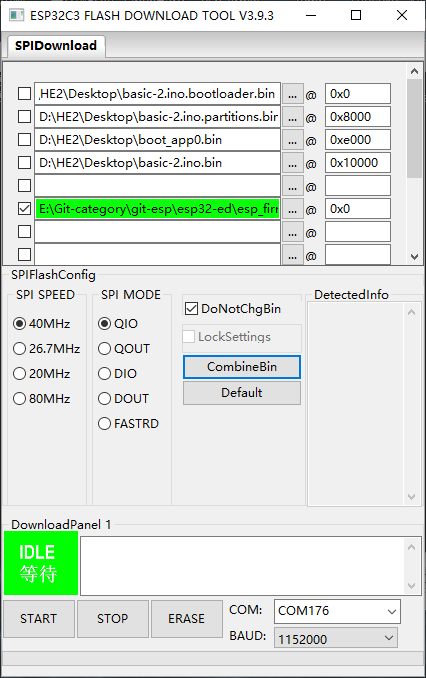
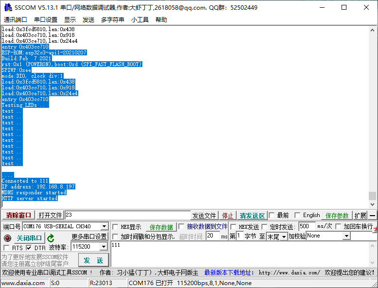

# NWI1126

Tested Env: 
- Arduino 1.8.19
- ESP32 2.0.9

### default test bin file:
.\esp_firmware\Firmware\NWI1126

### upload Config 

### Serial output Log 

    ESP-ROM:esp32c3-api1-20210207
    Build:Feb  7 2021
    rst:0x1 (POWERON),boot:0xd (SPI_FAST_FLASH_BOOT)
    SPIWP:0xee
    mode:DIO, clock div:1
    load:0x3fcd5810,len:0x438
    load:0x403cc710,len:0x918
    load:0x403ce710,len:0x24e4
    entry 0x403cc710
    Testing LEDs .. 
    test ..
    test ..
    test ..
    test ..
    test ..
    test ..
    test ..
    test ..
    test ..
    test ..

    ....
    Connected to 111
    IP address: 192.168.8.197
    MDNS responder started
    HTTP server started

